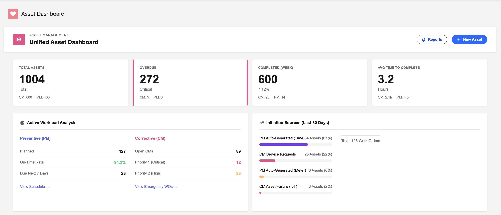
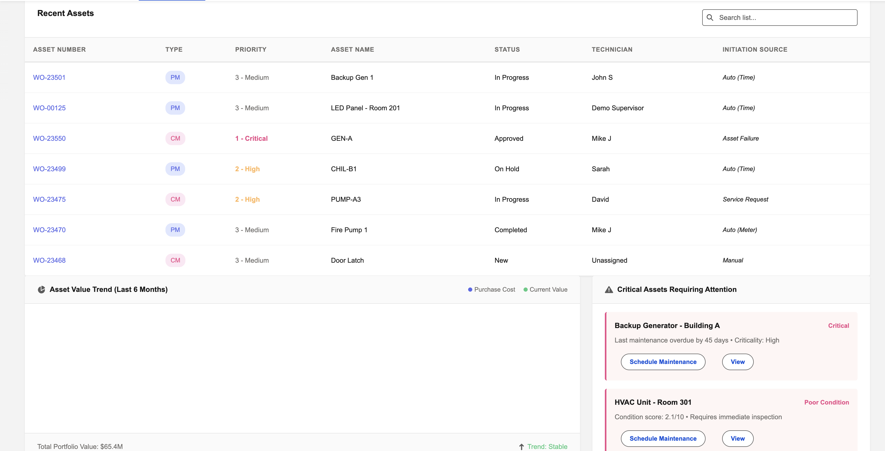
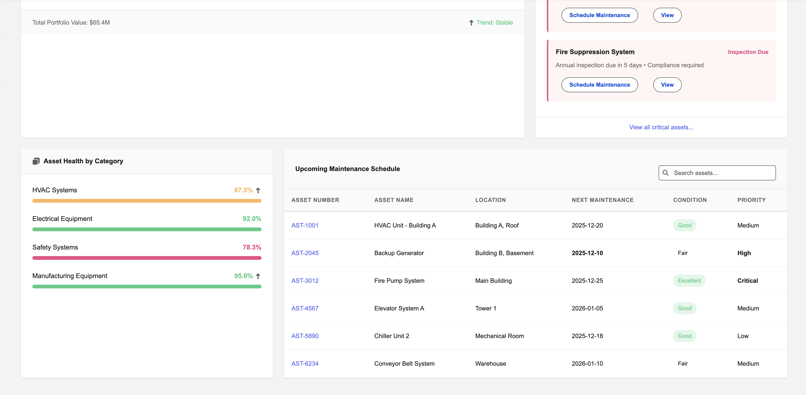
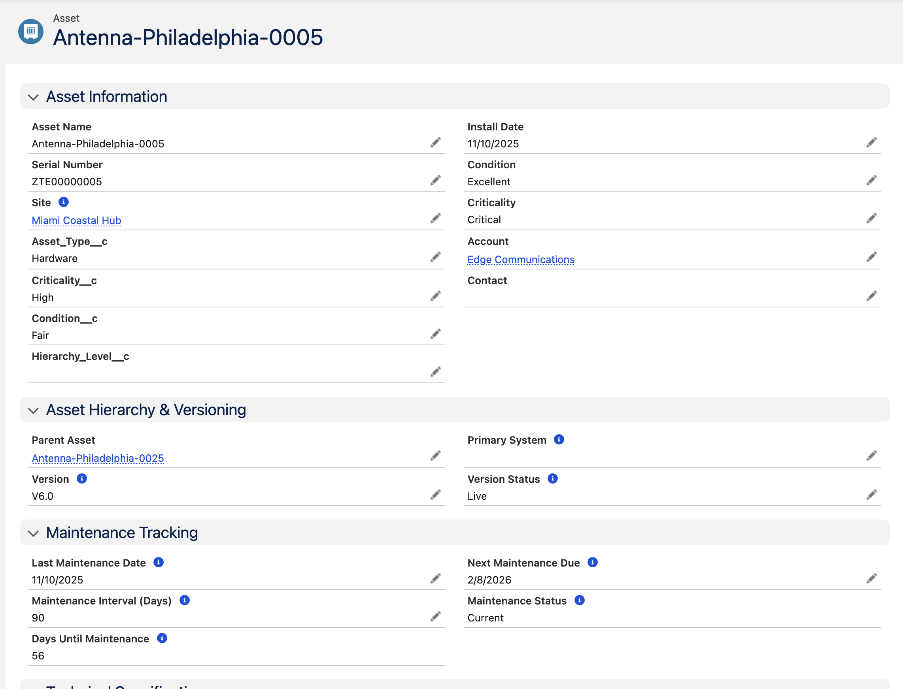
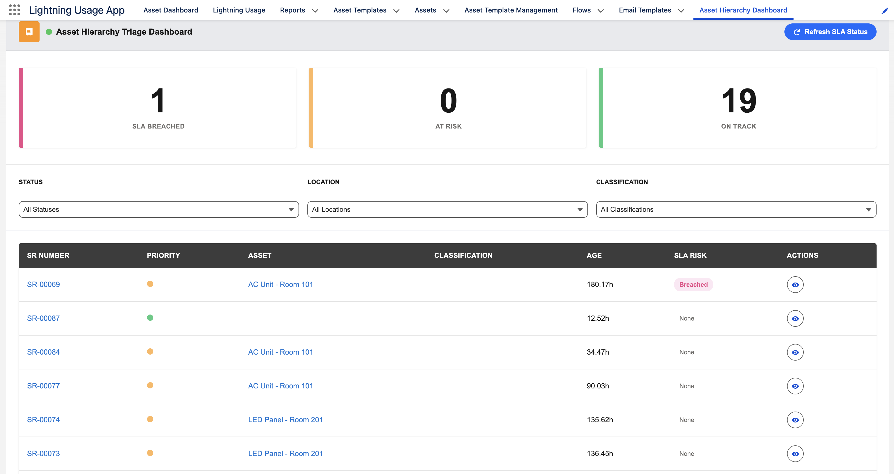
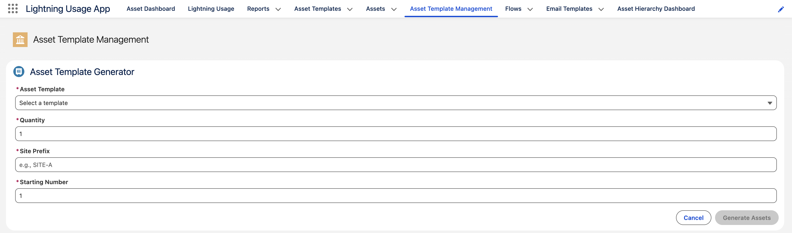

# AssetFlow Pro - Application Demo

Welcome to the visual tour of **AssetFlow Pro**. Below are snapshots demonstrating the key features and user interface of the application.

## 📊 Dashboard Overview
Visual insights into asset performance, maintenance status, and overall health.

*General dashboard view.*

*Detailed metrics and analytics.*

*Additional dashboard reporting widgets.*

---

## 📄 Asset Management

### Asset Details
Comprehensive view of individual asset specifications and history.

### Asset Hierarchy
Visual representation of asset dependencies and parent-child relationships.

### Asset Templates
Tools for creating and managing standardized asset templates.

